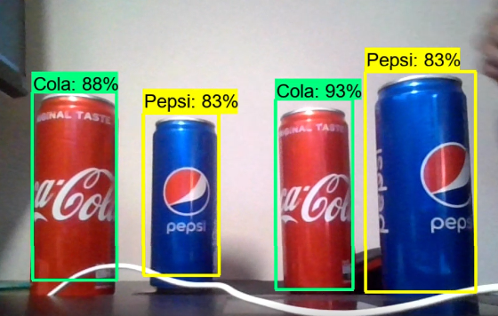

# TensorFlow-Object-Detection

This repository contains the necessary files to create a custom object detection model using TensorFlow Object Detection.

## Image Preprocessing

The "Image Preprocessing" section provides a notebook for preparing the data to be trained. The steps involved in the image preprocessing are as follows:

1. Setup Project
2. TFOD Utils & Google Images Downloader
3. Collect Images
4. Image Labeling
5. Split into Train and Test

## Training Model

The "Training Model" section focuses on training the object detection model. The model can be trained either on a local machine or using Google Colab for faster processing. The steps involved in creating and evaluating the model are:

1. Setup
2. Train the Model
3. Evaluate the Model
4. Freezing the Graph

## Detections

The "Detections" section demonstrates how to perform real-time object detections using OpenCV and TensorFlow object detection. The steps involved are:

1. Load the Model
2. Real-Time Detections
3. Images Detections

## TF Lite Converter

The "TF Lite Converter" section provides a notebook to convert the trained model to the TensorFlow Lite format. The steps involved are:

1. Freezing Graph
2. Convert to TF Lite
3. Convert to TensorFlow.js

Please refer to the respective notebooks and sections for detailed instructions on each step of the object detection process using TensorFlow.

## Screenshoots

Example of real-time detection on the Pepsi and Coca-Cola cans:

The screenshot showcases the object detection model in action, accurately detecting and labeling Pepsi and Coca-Cola cans in a live video feed. Please note that the performance and accuracy of the model may vary depending on the specific use case and environmental conditions.

